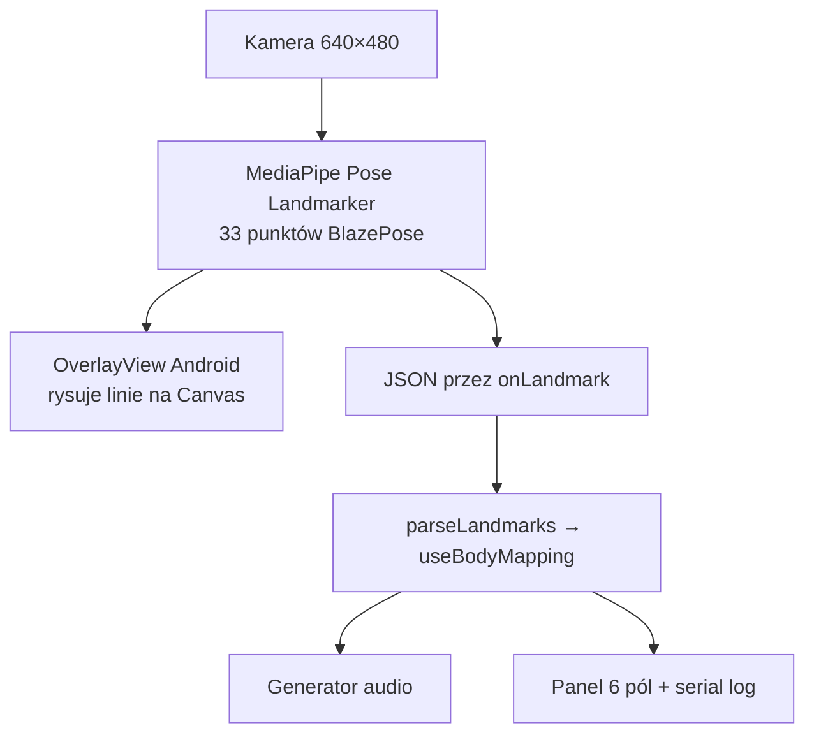

# Szkielet ciała, overlay i dane z API

Dokumentacja techniczna: jak działa wizualizacja szkieletu z kamery, co wraca z MediaPipe do JS i jakie dane są dostępne w aplikacji.

---

## Schemat pipeline



1. **Kamera** → `ImageAnalysis` → inference MediaPipe
2. **Native Android** (`CameraFragment.onResults`):
   - rysuje szkielet na `OverlayView` (nad podglądem kamery)
   - wysyła JSON do JS przez event `onLandmark`
3. **JS** (`PoseCameraView` → pipeline) parsuje punkty i liczy cechy ciała pod audio

Overlay i JS dostają **ten sam wynik inference** — overlay nie jest osobnym API.

---

## Skąd biorą się linie na ekranie?

Rysowanie odbywa się w **native Android**, nie w React.

Plik: `node_modules/@thinksys/react-native-mediapipe/android/.../OverlayView.kt`

MediaPipe dostarcza listę połączeń `PoseLandmarker.POSE_LANDMARKS` — każde połączenie to para **indeks start → indeks end**. Overlay iteruje po tej liście i rysuje `canvas.drawLine()` między punktami, które przechodzą filtr włączonej części ciała.

Wszystkie linie mają **ten sam kolor** — na ekranie nie ma podpisów typu „lewa ręka”.

Flagi włączające segmenty ustawiane są przez `GlobalState` (domyślnie wszystkie `true`):

| Flaga | Plik / mechanizm |
|-------|------------------|
| `isFaceEnabled` | `GlobalState.java` |
| `isTorsoEnabled` | … |
| `isLeftArmEnabled` | … |
| `isRightArmEnabled` | … |
| `isLeftWristEnabled` | … |
| `isRightWristEnabled` | … |
| `isLeftLegEnabled` | … |
| `isRightLegEnabled` | … |
| `isLeftAnkleEnabled` | … |
| `isRightAnkleEnabled` | … |

Propsy `RNMediapipe` (`face`, `torso`, `leftArm` itd.) trafiają do `TsMediapipeViewManager` i aktualizują `GlobalState`. `PoseCameraView` nie przekazuje tych flag — używane są defaulty biblioteki (wszystko włączone).

---

## Mapowanie: która linia to która część ciała?

**W kodzie tak, na ekranie nie.** Segmenty definiowane są po **indeksach punktów** BlazePose (0–32):

| Flaga overlay | Indeksy punktów | Jakie linie |
|---------------|-----------------|-------------|
| `face` | 0–10 | twarz, oczy, usta |
| `torso` | 11↔12, 11↔23, 12↔24, 23↔24 | barki + biodra |
| `leftArm` | 11→13→15 | bark → łokieć → nadgarstek L |
| `rightArm` | 12→14→16 | bark → łokieć → nadgarstek P |
| `leftWrist` | 15↔17, 15↔19, 15↔21… | dłoń lewa (palce) |
| `rightWrist` | 16↔18, 16↔20, 16↔22… | dłoń prawa |
| `leftLeg` | 23→25→27 | biodro → kolano → kostka L |
| `rightLeg` | 24→26→28 | biodro → kolano → kostka P |
| `leftAnkle` / `rightAnkle` | stopy | pięta, palce |

### Nazwy punktów (indeks → etykieta)

Plik: `src/pose/parsing/landmarkNames.ts` — `BLAZEPOSE_LANDMARK_NAMES`

| Indeks | Nazwa | Indeks | Nazwa |
|--------|-------|--------|-------|
| 0 | Nos | 17 | L-Palec wsk. |
| 1 | L-Oko wew. | 18 | P-Mały palec |
| 2 | L-Oko | 19 | L-Palec wsk. |
| 3 | L-Oko zew. | 20 | P-Palec wsk. |
| 4 | P-Oko wew. | 21 | L-Kciuk |
| 5 | P-Oko | 22 | P-Kciuk |
| 6 | P-Oko zew. | 23 | L-Biodro |
| 7 | L-Ucho | 24 | P-Biodro |
| 8 | P-Ucho | 25 | L-Kolano |
| 9 | Usta L | 26 | P-Kolano |
| 10 | Usta P | 27 | L-Kostka |
| 11 | **L-Bark** | 28 | P-Kostka |
| 12 | **P-Bark** | 29 | L-Pięta |
| 13 | **L-Łokieć** | 30 | P-Pięta |
| 14 | **P-Łokieć** | 31 | L-Stopa |
| 15 | **L-Nadgarstek** | 32 | P-Stopa |
| 16 | **P-Nadgarstek** | | |

Pogrubione indeksy używane są w `extractBodyFeatures` i detekcji (`isPoseDetected` sprawdza 11–16).

---

## Co wraca z API do JS?

Event: `onLandmark` (Android: `NativeEventEmitter`, iOS: `nativeEvent`).

Plik źródłowy payloadu: `CameraFragment.kt` → `onResults`.

### Struktura JSON

```json
{
  "landmarks": [
    { "x": 0.52, "y": 0.31, "z": -0.1, "visibility": 0.98, "presence": 0.99 },
    "... 33 elementy ..."
  ],
  "worldLandmarks": [
    { "x": 0.1, "y": -0.2, "z": 0.05, "visibility": 0.98, "presence": 0.99 },
    "... 33 elementy ..."
  ],
  "additionalData": {
    "width": 640,
    "height": 480
  }
}
```

| Pole | Znaczenie |
|------|-----------|
| `landmarks[0..32]` | Współrzędne **2D znormalizowane** względem obrazu (0–1; lewy górny róg = 0,0; y rośnie w dół) |
| `landmarks[].visibility` | Pewność widoczności punktu (0–1) |
| `landmarks[].presence` | Pewność obecności punktu (0–1) |
| `landmarks[].z` | Głębokość względna (MediaPipe) |
| `worldLandmarks[0..32]` | Współrzędne **3D** w przestrzeni metrycznej (względem bioder) |
| `additionalData.width/height` | Rozmiar klatki wejściowej analizy |

**Nie ma** w JSON gotowych „linii” ani nazw segmentów ciała — tylko 33 punkty. Połączenia szkieletu wynikają z `POSE_LANDMARKS` (native) lub można je zdefiniować w JS.

### Parsowanie w aplikacji

| Plik | Rola |
|------|------|
| `src/pose/parsing/parseLandmarks.ts` | `parseLandmarkPayload()` → `MediaPipePoseFrame` |
| `src/pose/types.ts` | Typy `PoseLandmark`, `MediaPipePoseFrame` |
| `src/pose/camera/PoseCameraView.tsx` | Odbiór eventu, przekazanie do pipeline |

---

## Jakie dane mamy w aplikacji?

### Surowe dane (pełne)

| Gdzie | Co |
|-------|-----|
| `MediaPipePoseFrame.landmarks` | Wszystkie 33 punkty 2D |
| `MediaPipePoseFrame.worldLandmarks` | Wszystkie 33 punkty 3D |
| Serial log `[BC:pose]` | Każdy punkt z nazwą z `landmarkNames.ts`, throttle ~1,2 s |

Log serial: `src/pose/debug/poseSerialLog.ts`  
Podgląd: `adb logcat | grep "BC:pose"`

### Dane wyprowadzone (pod audio i UI)

`extractBodyFeatures()` (`src/pose/features/bodyFeatures.ts`) liczy m.in.:

- `leftHandHeightRel`, `rightHandHeightRel` — wysokość dłoni względem barków
- `handsDistance` — rozstaw dłoni
- `bodyOpenness` — otwarcie tułowia
- `leftElbowAngle`, `rightElbowAngle`
- `torsoCenterY`
- prędkości (`useBodyVelocity`): `overallMovement`, `leftHandSpeed` itd.

Indeksy landmarków używane w ekstrakcji:

```ts
NOSE: 0
LEFT_SHOULDER: 11
RIGHT_SHOULDER: 12
LEFT_ELBOW: 13
RIGHT_ELBOW: 14
LEFT_WRIST: 15
RIGHT_WRIST: 16
LEFT_HIP: 23
RIGHT_HIP: 24
```

### Panel debug na ekranie

Tylko **6 wyprowadzonych** wartości (nie surowy szkielet):

| Etykieta UI | Pole `FullBodyState` |
|-------------|---------------------|
| L-Hand↑ | `leftHandHeightRel` |
| R-Hand↑ | `rightHandHeightRel` |
| Ruch | `overallMovement` |
| Otwarcie | `bodyOpenness` |
| Rozstaw | `handsDistance` |
| Tułów | `torsoCenterY` |

Definicja pól: `src/pose/debug/poseDebugFields.ts`

---

## Podsumowanie

| Pytanie | Odpowiedź |
|---------|-----------|
| Jak widać linie? | Native `OverlayView` rysuje na Canvas nad kamerą |
| Czy wiemy, co to za linia? | W kodzie tak (indeksy + flagi segmentów); na ekranie brak etykiet |
| Co wraca z API? | 33×2D + 33×3D punkty + rozmiar klatki |
| Czy mamy te dane w JS? | **Tak** — pełne `landmarks` i `worldLandmarks` |
| Co idzie do audio? | Wyprowadzone cechy (`FullBodyState`), nie surowe linie |

---

## Powiązane pliki

| Obszar | Ścieżka |
|--------|---------|
| Overlay native | `node_modules/.../OverlayView.kt` |
| Emisja JSON | `node_modules/.../CameraFragment.kt` |
| Flagi segmentów | `node_modules/.../GlobalState.java` |
| Kamera JS | `src/pose/camera/PoseCameraView.tsx` |
| Parsowanie | `src/pose/parsing/parseLandmarks.ts` |
| Nazwy punktów | `src/pose/parsing/landmarkNames.ts` |
| Cechy ciała | `src/pose/features/bodyFeatures.ts` |
| Serial log | `src/pose/debug/poseSerialLog.ts` |
| Patch native | `patches/@thinksys+react-native-mediapipe+0.0.21.patch` |

---

## Możliwe rozszerzenia (niezaimplementowane)

- Mapa `POSE_CONNECTIONS` w JS (start/end + nazwa segmentu)
- Kolorowanie linii per segment ciała
- Etykiety punktów na overlay
- Wyłączanie segmentów z poziomu `PoseCameraView` (propsy `face`, `torso` itd.)